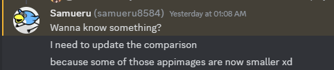
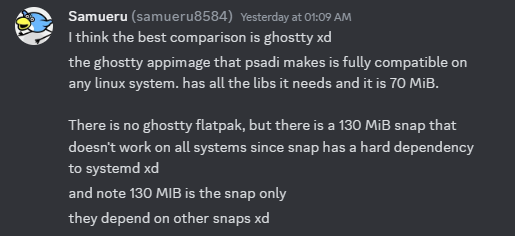

# **Soaring Through the Future**

With Self-Packaged Linux Apps

--- 

# **About Me**

Speaker: Souhrud Reddy

About me: A linux enthusiast in my spare time

Also a package maintainer for Soar, for Pixelpulse2

My Website: https://sounddrill31.github.io

--- 
# **Topics Covered**
- Why is any of this needed?
- AppImages - What, how and why?
- Sharun and lib4bin
- A tale of Pixelpulse2 and student frustrations
- Compatibility with other Linux Distributions

--- 

# **Quick Overview**
In this presentation, we'll explore Modern AppImages, the Soar Package Manager and how dependencies are handled. 

This will not be a technical deep-dive, just a quick demonstration.

--- 

# **The Elephant in the Room: Why?**
Linux apps aren't always portable! Users want something that "just works" across any distro they install, be it Ubuntu, Debian, PopOS, Arch, or even Alpine Linux

(Image by SEO Galaxy at [Unsplash](https://unsplash.com/photos/a-woman-sitting-in-front-of-a-laptop-computer-dJpBpPUevSA))
<!--Fumbling with solutions is not a good look, neither are huge installs -->
<!-- Users load linux to escape bloat, not cause them -->

---

# **The Elephant in the Room: Why AppImages?**

- Why not Flatpak/Snaps? 
Eg. Flatpak vs AppImage

<!-- Give supporting screenshots and thoughts -->

---

When I spoke to Samuel about this, he said:

---

# **AppImages and their History: probonopd**
- The AppImage project was initially made by Simon Peter, who was really interested in the “one app = one file” idea
- Here's an interview by Abhishek from IT'S FOSS 
https://itsfoss.com/appimage-interview/

---

# **AppImages and their History: probonopd**
- Also made go-appimage which can be used to make static binaries, though we'll take a slightly different approach
- Also responsible for type2-runtime which normal AppImages use to execute the App Binaries, though we'll take a slightly different approach again
--- 

# **AppImages and their History: PkgForge**
<!-- - Not just limited to AppImages but also other static and self-contained binaries but this one will focus on AppImages-->

--- 
## **The Dynamic Linker**

--- 
## **Quick Breakdown of sharun, lib4bin and the AppRun File**
<!-- Run the app, lib4bin -->

<!-- This will set up all the files we need automatically along with a dynamic linker - this means we can avoid rpath or patchelf shenanigans
 -->
---
# **Quick Breakdown of AppImages: File Structure**
When working with lib4bin, we end up with a file structure like this:
- *AppDir*
    - path/to/my/bins eg. `AppDir/shared/bin/pixelpulse2`
    - path/to/my/libs eg. `AppDir/shared/lib/libsmu.so`
    - icon file
    - desktop file
And more libraries automatically picked up by lib4bin

<!--not needed if we're not doing anything special or copying over files, -->

---
# **Pixelpulse2: Backstory**

--- 
# **Pixelpulse2: Initial Build**

--- 
# **Pixelpulse2: Modernization**

--- 

# **Soar, and other distribution methods**

--- 

# **Live Demo Time! Making a quick AppImage!**
<!-- Quick flow, mermaid diagram -->
--- 
# **Another Small change: uruntime**
<!--Uruntime, what why how-->
---
# **Live Demo Time! Making a quick Soar Package**

--- 
# **Credits**

--- 
--- 
## **This Presentation was made completely with MarkDown thanks to Marp!**

https://marp.app/

View the slides: https://sounddrill31.github.io/FOSSUnited-Slides-AppImages/
