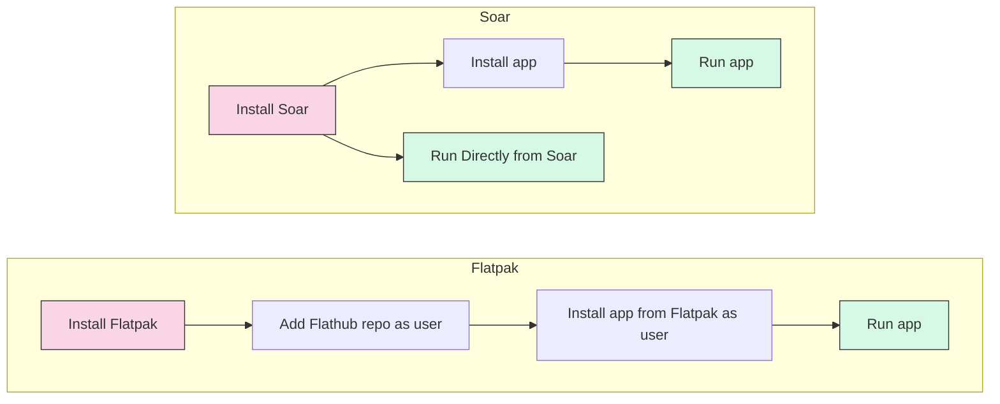

# **Soaring Through the Future**

With Self-Packaged Linux Apps

Providing a Quick, Easy and Painless Experience

---

# **About The Presenters**

Speaker: Souhrud Reddy
About me: A linux enthusiast in my spare time
Also a package maintainer for Soar, for Pixelpulse2
My Website: https://sounddrill31.github.io

--- 
# **About The Presenters**
<!-- -->
Speaker: Aditya

About me: 

TODO: Fill

My Website: 

--- 
# **Topics Covered**
- Why is any of this needed?
- soar and PkgForge
- A Brief Look at AppImages
- `.SBUILD`, soar's yaml based package listing format

--- 

# **Quick Overview**
In this presentation, we'll explore the Soar Package Manager, how to use it and how you can submit your own AppImages and binaries.  

This will not be a technical deep-dive, just a quick demonstration.

--- 
New users want something that "just works" across any distro they install, be it Ubuntu, Debian, PopOS, Arch, or even Alpine Linux

<!-- You can use this to quickly install and run static apps on any linux distro -->

<!--This is comparable to Homebrew-->

(Image by SEO Galaxy at [Unsplash](https://unsplash.com/photos/a-woman-sitting-in-front-of-a-laptop-computer-dJpBpPUevSA))
<!--Fumbling with solutions is not a good look, neither are huge installs -->
<!-- Users load linux to escape bloat, not cause them -->

---

# **Why AppImages?**

Difference: | Snap and snapd | Flatpak and runtimes | AppImages and similar formats |
| --- | --- | --- | --- |
| Developed by | Canonical | Community ✅ | Community ✅ | 
| Lock in | Tied to Snap Ecosystem | No Lock in | No Lock in |
| Dependencies | snapd and many more | Flatpak Runtimes | One App = One File |

---

<!-- Give supporting screenshots and thoughts -->

---
Previous Image from https://github.com/prusa3d/PrusaSlicer/issues/13653#issuecomment-2500109771

When I spoke to Samuel about this, he said:

---
# **Introduction to PkgForge**
Core Team:
- QaidVoid (Lead Dev, also made Soar)
- Azathothas (Lead Maintainer)
- ahqsoftwares, Tamrakar182 (Lead for Soar Index)

###### The QR Code links to the official discord

---
Worthy Mentions/Massive Contributions from:
- VHSGunzo(Enhanced AppImage and ELF tools)
    - Worked on uruntime for AppImage(and similar formats)
    - Made building static binaries trivial using `sharun` and `lib4bin`
- Ivan-HC (Made AppImage management easier with AM/AppMan)

---
# **What is soar?**

Soar is a Fast, Modern, Bloat-Free Distro-Independent Package Manager that Just Works
- Supports Static Binaries, AppImages, and other Portable formats on any *Unix-based Distro 
- Made by Rabindra Dhakal(QaidVoid)
- https://soar.qaidvoid.dev/

---
# **The Elephant in the Room: Why soar?**
"Why would I use soar over existing solutions?"
Soar doesn't attempt to replace your OS level package manager(like apt, dnf, etc)
This helps you load completely portable packages that are independent from your OS install!
Image from XKCD, Ch 927 "STANDARDS"

---

# **How to use soar?**

---
# **Quick Live Demo! Using soar and Installing Apps**
Installing Guide: https://soar.qaidvoid.dev/installation#install-script
Directly Running Apps without installing beforehand: `soar run appname`

Installing Apps to System: `soar install appname`
- Running the installed app: `appname`

It's. That. Simple. 

---
# **A quick look at the `.SBUILD` format**

--- 
<!--# **Credits**

--- --->

## **This Presentation was made completely with MarkDown thanks to Marp!**

https://marp.app/

View the slides: https://sounddrill31.github.io/FOSSUnited-Slides-Soar
